# Построение Underlay сети с использованием OSPF
## Цель:
Настроить OSPF для Underlay сети.
### План работы -test
- Для IP адресации возьмем схему из лабораторного задания 1
- Для конечных устройств, определить используемую IP подсеть
- Настроить OSPF в Underlay сети, для IP связанности между всеми сетевыми устройствами
- Убедится в наличии IP связанности между устройствами в OSFP домене

Возьмем для основы схему из 1-й лабораторной работы, к ней добавим IP подсети для конечных устройств, пример схемы L3 приведен ниже:  

Для Хостов которые будут жить за лифами будем использовать сеть 192.168.x.0/24  
где х - это номер leaf 
Поехали: 
### 1. Давайте добавим SVI адреса и VLAN для подключения хостов - Настраиваем Leaf 1 
- Создаем vlan 1, для сети хостов  
  vlan  
   name Host_Network 
  - Согдаем интерфейс vlan 1 
      
- interface Vlan1 
   ip address 192.168.1.1/24 
  
  Теперь проверим доступность хоста с ip адресом 192.168.1.2, который находится за 3-м ethernet портом: 
  leaf1# 
leaf1#ping 192.168.1.2 
PING 192.168.1.2 (192.168.1.2) 72(100) bytes of data. 
 
--- 192.168.1.2 ping statistics --- 
5 packets transmitted, 0 received, 100% packet loss, time 43ms 
  
Хост не доступен, проверяем настройки порта eth3, который смотрит в сторону хоста: 
interface Ethernet3 
   description -=Direction to host=- 
   no switchport 
  
   Меняем конфигурацию порта на switchport, проверяем. 
   leaf1# ping 192.168.1.2 
PING 192.168.1.2 (192.168.1.2) 72(100) bytes of data. 
80 bytes from 192.168.1.2: icmp_seq=1 ttl=64 time=10.1 ms 
  
## Настроим и включим ospf на интерфейсах eth1 and eth2 на leaf1, интерфейсы идут в сторону spein1 / spine 2
leaf1(config)#int eth1 
leaf1(config-if-Et1)#ip ospf area ? 
  A.B.C.D         OSPF area-id in IP address format 
  <0-4294967295>  OSPF area-id in decimal format 
  
leaf1(config-if-Et1)#ip ospf area 0.0.0.0 
leaf1(config-if-Et1)#ip ospf network point-to-point 
 
Аналогичные настройки прописываем на интерфейсе eth2 
 
interface Ethernet2 
   description Peer-to-peer link to Spine-2 
   no switchport 
  ip address 10.0.1.4/31   
   ip ospf network point-to-point 
   ip ospf area 0.0.0.0 
!
### try to enable OSPF proccess on leaf1
leaf1(config)#router ospf 1 
leaf1(config-router-ospf)#router-id 10.0.0.1 
 
After this command entered, we can see the first message from leaf 1, you can see it on screen below:

As you can see, после включения оспиэф, первое сообщение от роутера, это IGMP которое сообщает, что роутер присоединился к группе мультикасата с адресом  224.0.0.5  
### Теперь, давайте рассмотрим первое Hello сообщение от Leaf1
На рисунке ниже представлен скриншот сообщения, давайте посмотрим, на что стоит обратить внимание?

### - Ethernet level:
      Мы видим в Destination field, Individual/Group, вы видим выставлен bit = 1 (Для множества устройств, в нашем случае мультикаст адрес)
        
### - IP Level
1. Мы видим, что коммутатор выставил приоритетность обработки пакета в поле DSCP, значение 1100 00 (48) Class Selector 6, это надо учесть в будущем при настройки глобальной политики QoS в ЦОД-е
2. Мы видим, что установлен флаг 010, Don't fragment - фрагментация не допускается, по этой причине, с обоих сторон MTU должен быть одинаковый!
3. В адресе назначения, мы видим мультикаст IP адрес: 224.0.0.5   

### - Interier Gateway Protocol OSPF
1. Далее мы видим наш протокол 89 OSPF, который вещает на мультикаст адрес 224.0.0.5 сообщения.
2. Первое сообщение которое мы видим, это Hello, мы видим Hello Packet (1) сообщение 1-е
3. In Source address we can see 10.0.1.0 - it's address of peer-to peer interface
4. But in OSPF Header we can see that Source OSPF Router is: 10.0.0.1 , it's loopback interface that used like OSPF router ID.

5. Мы видимо, что Designated router 0.0.0.0 еще не выбран.
6. Выставлен бит 1, External routing Capable.
7. Hello time interval = 10 sec
8. Давайте проверим, что раз в 10 сек. шлются Хеллоу пакеты?

  

Как видно разница по времени между фремом 27 и 28, равняется 10 Sec.
  

    
#### Leaf 1, конфигурация порта в сторону хоста 
  
interface Ethernet3 
         description -=Direction to host=- 
         no switchport 
         ip address 192.168.1.1/24 
            

# Настройка OSPF Spine1
      spine1(config)#interface Loopback1  
      spine1(config-if-Lo1)#__ip ospf area 0.0.0.0__  
  
spine1(config)#interface Ethernet1  
      spine1(config-if-Et1)#__ip ospf area 0.0.0.0__ 
      spine1(config-if-Et1)#__ip ospf network point-to-point__  
  
Далее включаем OSPF процесс, командой, __Router ospf 1__ , пример ниже: 
spine1(config)#__router ospf 1__ 
spine1(config-router-ospf)#__router-id 10.1.1.1__ 
  после чего начинает бегать OSPF, давайте более подробно рассмотрим, процесс, установления соседства между маршрутизаторами.
Как мы уже и видели по предыдущему анализу, первым идет IGMP сообщение, подписка на группу Multicast 224.0.0.5  
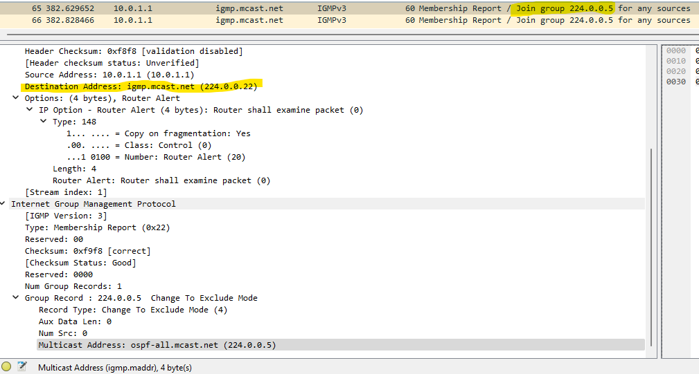
Но тут мне не совсем понятно почему destination address 224.0.0.22  
далее 2-ва соседа обмениваются hello сообщениями
2-е сообщение после подписки на мультикаст, идет INITialization  ОТ LEAF1, Т.К НА НЕМ УЖЕ OSPF НАСТРОЕН И РАБОТАЕТ 
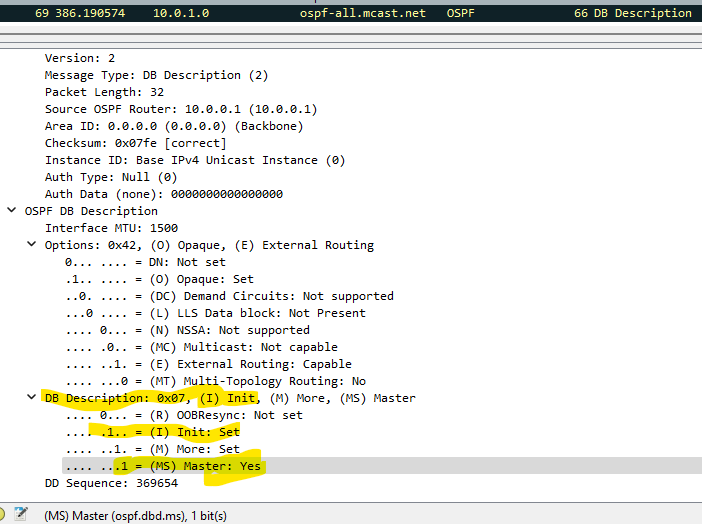
 
Spine 1 отвечает аналогичным сообщением init, в нем практически ничего не отличается кроме cheksum
 
Leaf1 Шлет OSPF, LSA-1  
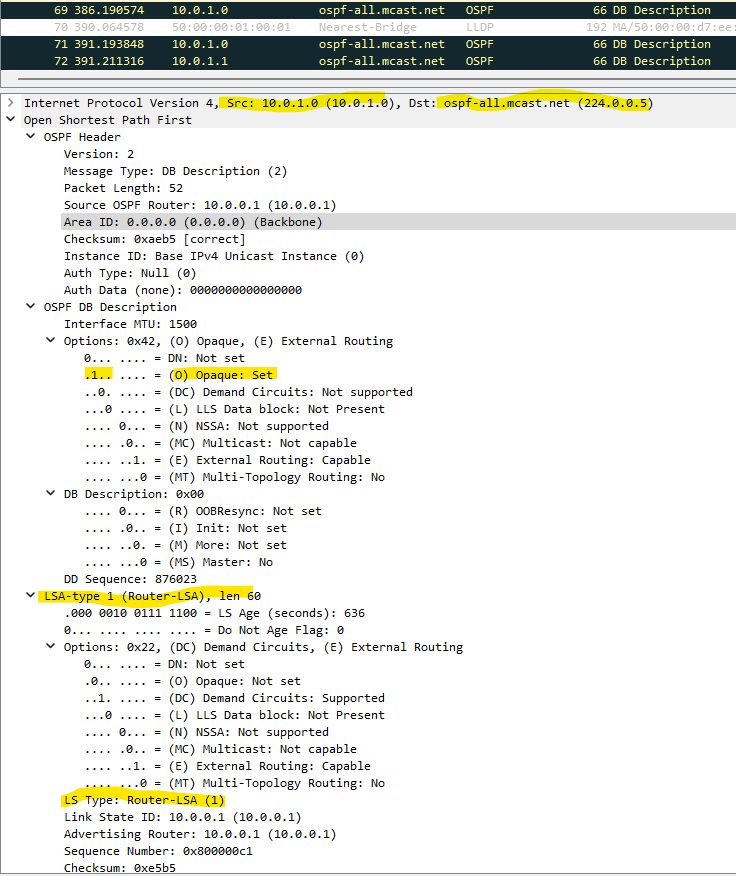
 
Далее  видим сообщение __Link State request__  
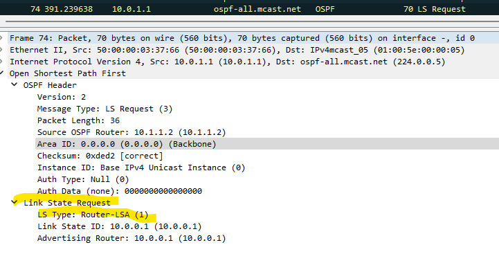  

Далее, в сообщении OSPF мы видим используется в качестве Router ID, значение интерфейса loopback2 spine 1, это довольно странно, чуть позже посморим конфигурацию спайн1.  
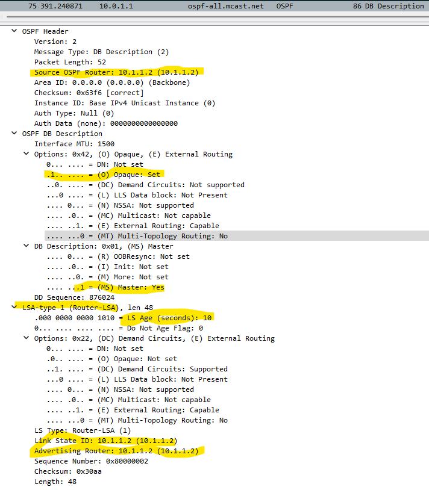  
А теперь ребята, мы видим, наконец-то пришел Link State Update, от нашего Leaf1, c перечислением 3-х подсетей, которые у него имеются.
Ниже представлен скрин:  
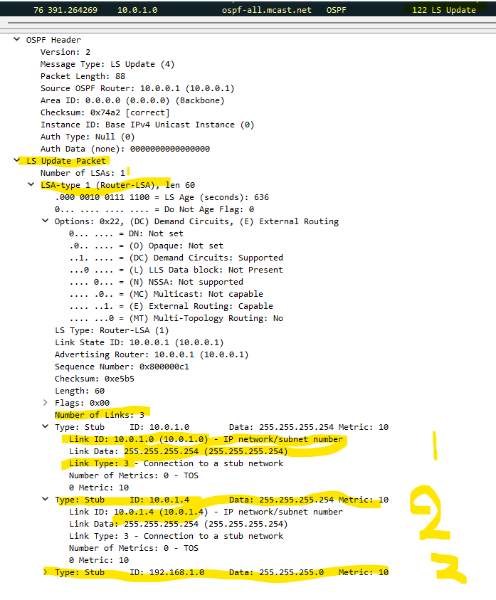
 
Далее Leaf1 продолжает свою активность, и в след за сообщением __Link state Update__, посылает __Link state Requet__, снизу представлен пример:  
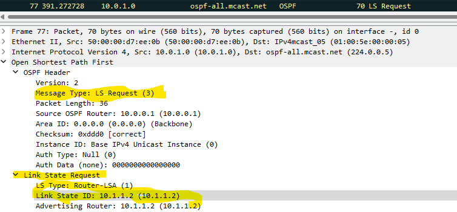  
В свою очередь leaf1 продолжает рассылать различные сообщения, и в этот раз решил послать _ospf DB Description__, что это бы значило, не понятно, но пример представлен снизу:  
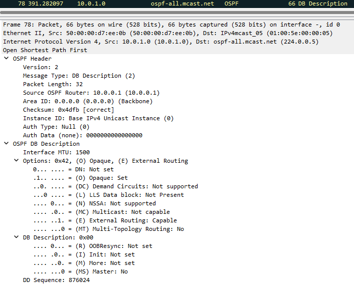
 
После всех этих сообщений, spine1 соизволил ответить сообщением __Link State Acknowledge__, пример как обычно представлен под текстом:  
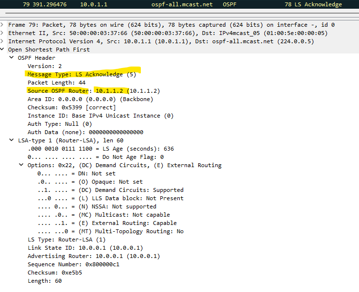
 
Затем после __Acknowledge__ spine1 посылает __Link State Update__ message;  

 
Spine1 понял, что не все послал, и решил сразу же кинуть еще один __LSA Update__ добавив туда peer to peer сеть, выделил желтым, смотрите:  
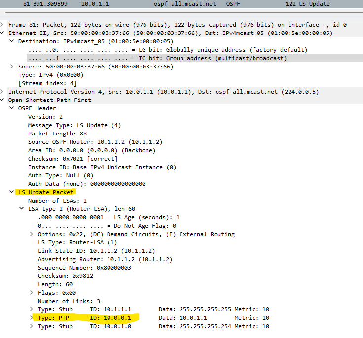
 
В знак взаимного уважения, LEAF1 ОТВЕЧАЕТ СООБЩЕНИЕМ __Link State Acknowledge__:  
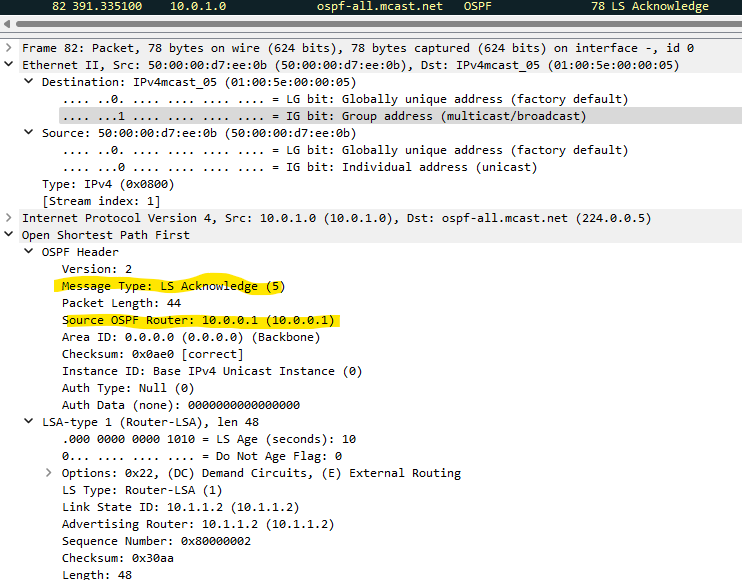
 
  
Далее они еще раз по очереди обменяются любезностями, вместе со своими пакетами, потом будут слать друг другу hello пакеты,  
с таймером в 10 секунд, проверять не помер ли кто, вот в кратце как-то так. 

## Добавление аналогичных настроек ospf на spine2 и leaf2/3

### Настройки spine2
interface Loopback1  
   description IP for underlay -Router-ID  
   ip address 10.2.2.1/32 
   __ip ospf area 0.0.0.0__ 
 
 
interface Ethernet1 
   description Peer-to-peer link to leaf-1 
   no switchport 
   ip address 10.0.1.5/31 
   __ip ospf network point-to-point__  
   __ip ospf area 0.0.0.0__ 
!  
interface Ethernet2 
   description Peer-to-peer link to leaf-2 
   no switchport 
   ip address 10.0.2.5/31 
   __ip ospf network point-to-point__ 
   __ip ospf area 0.0.0.0__ 
!  
interface Ethernet3 
   description Peer-to-peer link to leaf-3 
   no switchport 
   ip address 10.0.3.5/31 
   __ip ospf network point-to-point__ 
  
После включения настроенной маршрутизации on spine2, командой ip routing, я снял трейс на spine 1, интерфейс eth1, примерно через 15 секунд, прилетелеи update с leaf1.  
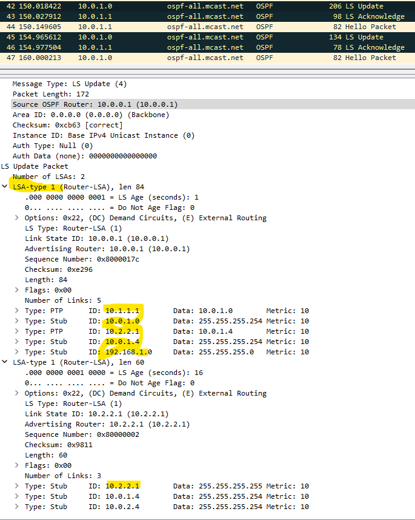 
Как видно из трейса 42 сообщение, на Spine1 прилетает __Link State UPDATE__ сообщение, и вслед 43-м сообщением spine1 отвечает __Link State Acknowledge__ 
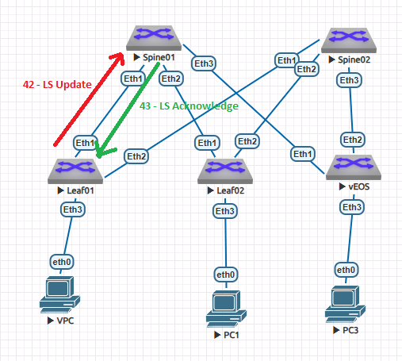 
### Проверка появления маршрутов OSPF

spine1#sho ip route
VRF: default
Codes: C - connected, S - static, K - kernel,
       O - OSPF, IA - OSPF inter area, E1 - OSPF external type 1,
       E2 - OSPF external type 2, N1 - OSPF NSSA external type 1,
       N2 - OSPF NSSA external type2, B - Other BGP Routes,
       B I - iBGP, B E - eBGP, R - RIP, I L1 - IS-IS level 1,
       I L2 - IS-IS level 2, O3 - OSPFv3, A B - BGP Aggregate,
       A O - OSPF Summary, NG - Nexthop Group Static Route,
       V - VXLAN Control Service, M - Martian,
       DH - DHCP client installed default route,
       DP - Dynamic Policy Route, L - VRF Leaked,
       G  - gRIBI, RC - Route Cache Route

Gateway of last resort is not set

 C        10.0.1.0/31 is directly connected, Ethernet1
 O        10.0.1.4/31 [110/20] via 10.0.1.0, Ethernet1
 C        10.0.2.0/31 is directly connected, Ethernet2
 C        10.0.3.0/31 is directly connected, Ethernet3
 C        10.1.1.1/32 is directly connected, Loopback1
 C        10.1.1.2/32 is directly connected, Loopback2
 O        192.168.1.0/24 [110/20] via 10.0.1.0, Ethernet1

 
## Какие настройки добавили на Spine1 для работы OSPF?
!  
interface Ethernet1  
   description Peer-to-peer link to leaf-1 
   no switchport 
   ip address 10.0.1.1/31 
 ###  ip ospf network point-to-point
###   ip ospf area 0.0.0.0
 
 

### Leaf 2, конфигурация порта в сторону хоста 
interface Ethernet5  
   description -=Direction to hosts=- 
   no switchport 
   ip address 192.168.2.1/24 

 
#### Leaf 3, конфигурация порта в сторону хоста 
interface Vlan3 
   ip address 192.168.3.1/24 
  
   interface Ethernet3 
   switchport access vlan 3 

