# Лабораторная работа: Построение Underlay сети с использованием OSPF

## 1. Введение

### 1.1 Цель работы
Настроить протокол OSPF для обеспечения IP-связности (Underlay сети) между сетевыми устройствами в топологии spine-leaf.

### 1.2 Критерии успеха
1. Все сетевые устройства имеют IP-связность в Underlay сети
2. OSPF соседства установлены в состоянии **Full**
3. В таблицах маршрутизации присутствуют все Loopback и P2P интерфейсы
4. Хосты имеют доступ к удаленным Leaf коммутаторам

### 1.3 Используемое оборудование
- **Симулятор:** EVE-NG / Arista vEOS
- **Топология:** 2 Spine, 3 Leaf коммутатора
- **Хосты:** 3 (по одному за каждым Leaf)

---

## 2. Топология и план адресации

### 2.1 Схема сети


### 2.2 Таблица адресации

| Устройство | Интерфейс | IP-адрес | Назначение |
|------------|-----------|----------|------------|
| **Leaf1** | Loopback0 | 10.0.0.1/32 | Router-ID |
| | Ethernet1 | 10.0.1.0/31 | P2P к Spine1 |
| | Ethernet2 | 10.0.1.4/31 | P2P к Spine2 |
| | Vlan10 | 192.168.1.1/24 | Хостовая сеть |
| **Leaf2** | Loopback0 | 10.0.0.2/32 | Router-ID |
| | Ethernet1 | 10.0.2.0/31 | P2P к Spine1 |
| | Ethernet2 | 10.0.2.4/31 | P2P к Spine2 |
| | Vlan20 | 192.168.2.1/24 | Хостовая сеть |
| **Leaf3** | Loopback0 | 10.0.0.3/32 | Router-ID |
| | Ethernet1 | 10.0.3.0/31 | P2P к Spine1 |
| | Ethernet2 | 10.0.3.4/31 | P2P к Spine2 |
| | Vlan30 | 192.168.3.1/24 | Хостовая сеть |
| **Spine1** | Loopback1 | 10.1.1.1/32 | Router-ID |
| | Ethernet1 | 10.0.1.1/31 | P2P к Leaf1 |
| | Ethernet2 | 10.0.2.1/31 | P2P к Leaf2 |
| | Ethernet3 | 10.0.3.1/31 | P2P к Leaf3 |
| **Spine2** | Loopback1 | 10.2.2.1/32 | Router-ID |
| | Ethernet1 | 10.0.1.5/31 | P2P к Leaf1 |
| | Ethernet2 | 10.0.2.5/31 | P2P к Leaf2 |
| | Ethernet3 | 10.0.3.5/31 | P2P к Leaf3 |
| **Host1** | eth0 | 192.168.1.2/24 | Шлюз: 192.168.1.1 |
| **Host2** | eth0 | 192.168.2.2/24 | Шлюз: 192.168.2.1 |
| **Host3** | eth0 | 192.168.3.2/24 | Шлюз: 192.168.3.1 |

---

## 3. Настройка Underlay сети (OSPF)

### 3.1 Настройка Leaf1

#### 3.1.1 Настройка Loopback (Router-ID)

```
cisco
interface Loopback0
   description OSPF Router-ID
   ip address 10.0.0.1/32
   ip ospf area 0.0.0.0
```
#### 3.1.2 Настройка P2P интерфейсов к Spine
```
cisco
interface Ethernet1
   description Peer-to-peer link to Spine1
   no switchport
   ip address 10.0.1.0/31
   ip ospf network point-to-point
   ip ospf area 0.0.0.0

interface Ethernet2
   description Peer-to-peer link to Spine2
   no switchport
   ip address 10.0.1.4/31
   ip ospf network point-to-point
   ip ospf area 0.0.0.0
```
#### 3.1.3 Настройка хостовой сети (VLAN и SVI)
```
cisco
vlan 10
   name Host_Network

interface Vlan10
   ip address 192.168.1.1/24

interface Ethernet3
   description Connection to Host1
   switchport mode access
   switchport access vlan 10
   spanning-tree portfast
```
#### 3.1.4 Включение OSPF процесса
cisco
router ospf 1
   router-id 10.0.0.1
### 3.2 Настройка Spine1
#### 3.2.1 Настройка Loopback (Router-ID)
```
cisco
interface Loopback1
   description IP for underlay - Router-ID
   ip address 10.1.1.1/32
   ip ospf area 0.0.0.0
```
#### 3.2.2 Настройка P2P интерфейсов к Leaf
```
cisco
interface Ethernet1
   description Peer-to-peer link to Leaf1
   no switchport
   ip address 10.0.1.1/31
   ip ospf network point-to-point
   ip ospf area 0.0.0.0

interface Ethernet2
   description Peer-to-peer link to Leaf2
   no switchport
   ip address 10.0.2.1/31
   ip ospf network point-to-point
   ip ospf area 0.0.0.0

interface Ethernet3
   description Peer-to-peer link to Leaf3
   no switchport
   ip address 10.0.3.1/31
   ip ospf network point-to-point
   ip ospf area 0.0.0.0
#### 3.2.3 Включение OSPF процесса
cisco
router ospf 1
   router-id 10.1.1.1
```
# 4. Анализ работы OSPF
## 4.1 Формат Hello-пакета
При включении OSPF процесса, коммутатор начинает отправлять Hello-пакеты на мультикаст-адрес 224.0.0.5 (AllSPFRouters). Рассмотрим структуру пакета:

### 4.1.1 Ethernet уровень
Destination MAC: 01-00-5E-00-00-05 (мультикаст, соответствующий IP 224.0.0.5)

Individual/Group bit: установлен в 1 (пакет предназначен для группы устройств)

### 4.1.2 IP уровень
DSCP: значение 48 (Class Selector 6) — OSPF устанавливает высокий приоритет для своих пакетов, что важно учитывать при настройке QoS

Don't Fragment (DF): установлен в 1 — фрагментация не допускается, требуется согласование MTU на обеих сторонах

Destination IP: 224.0.0.5

Protocol: 89 (OSPF)

#### 4.1.3 OSPF Hello-пакет
Поле	Значение	Описание
Version	2	OSPFv2
Type	1	Hello Packet
Router ID	10.0.0.1	Идентификатор маршрутизатора (Loopback)
Area ID	0.0.0.0	Backbone area
Authentication	0	Аутентификация не используется
Network Mask	/31	Маска сети интерфейса
Hello Interval	10 sec	Интервал отправки Hello
Dead Interval	40 sec	Время ожидания (4 × Hello)
Router Priority	1	Приоритет для выбора DR/BDR
DR	0.0.0.0	Designated Router (не выбран)
BDR	0.0.0.0	Backup Designated Router (не выбран)
Active Neighbor	0.0.0.0	Список активных соседей
Примечание: Для P2P линков DR/BDR не выбираются, поэтому соответствующие поля обнулены.

### 4.2 Процесс установления OSPF соседства
Процесс установления соседства между Leaf1 и Spine1 проходит следующие этапы:

Состояние	Описание	Пакеты
Down	Нет активного соседа	—
Init	Получен Hello-пакет, но Router-ID отправителя не найден	Hello
2-Way	Получен Hello с собственным Router-ID	Hello
ExStart	Выбор Master/Slave, установление последовательности	DB Description
Exchange	Обмен описаниями базы данных	DB Description
Loading	Запрос недостающих LSA	LS Request, LS Update
Full	Базы данных синхронизированы	LS Acknowledge
#### 4.2.1 Анализ трафика установления соседства
IGMP (не OSPF): Первые пакеты — это IGMP-сообщения о присоединении к мультикаст-группе 224.0.0.5. Важно: OSPF не использует IGMP напрямую, это работа стека TCP/IP.

Hello (Init): Обмен Hello-пакетами для обнаружения соседа.

DB Description (ExStart/Exchange): Обмен описаниями LSA для синхронизации базы данных.

LS Request/LS Update (Loading): Запрос и получение недостающих LSA.

LS Acknowledge: Подтверждение получения LSA.

### 4.3 Типы LSA в OSPF
В процессе установления соседства наблюдаются следующие типы LSA:

Тип LSA	Название	Содержание
Type 1	Router LSA	Информация о маршрутизаторе и его интерфейсах
Type 2	Network LSA	Формируется DR (не используется на P2P)
Type 3	Summary LSA	Межзонные маршруты (в данной работе все в Area 0)
В данной топологии (все интерфейсы в Area 0) распространяются только Type 1 LSA (Router LSA). Каждый Router LSA содержит информацию о:

Loopback интерфейсе (/32)

P2P линках (/31)

Сетях, подключенных к хостам (VLAN)

# 5. Верификация
## 5.1 Проверка OSPF соседств
```
Leaf1:

cisco
leaf1# show ip ospf neighbor

Neighbor ID     Pri State            Dead Time Address         Interface
10.1.1.1          0 FULL/  -          00:00:36 10.0.1.1       Ethernet1
10.2.2.1          0 FULL/  -          00:00:33 10.0.1.5       Ethernet2
Spine1:

cisco
spine1# show ip ospf neighbor

Neighbor ID     Pri State            Dead Time Address         Interface
10.0.0.1          0 FULL/  -          00:00:35 10.0.1.0       Ethernet1
10.0.0.2          0 FULL/  -          00:00:32 10.0.2.0       Ethernet2
10.0.0.3          0 FULL/  -          00:00:34 10.0.3.0       Ethernet3
Spine2:

cisco
spine2# show ip ospf neighbor

Neighbor ID     Pri State            Dead Time Address         Interface
10.0.0.1          0 FULL/  -          00:00:38 10.0.1.4       Ethernet1
10.0.0.2          0 FULL/  -          00:00:35 10.0.2.4       Ethernet2
10.0.0.3          0 FULL/  -          00:00:37 10.0.3.4       Ethernet3
```
### 5.2 Проверка таблицы маршрутизации
```
Leaf1:

cisco
leaf1# show ip route ospf

O        10.0.0.2/32 [110/20] via 10.0.1.1, Ethernet1
                    [110/20] via 10.0.1.5, Ethernet2
O        10.0.0.3/32 [110/20] via 10.0.1.1, Ethernet1
                    [110/20] via 10.0.1.5, Ethernet2
O        10.1.1.1/32 [110/10] via 10.0.1.1, Ethernet1
O        10.2.2.1/32 [110/10] via 10.0.1.5, Ethernet2
O        10.0.2.0/31 [110/20] via 10.0.1.1, Ethernet1
                     [110/20] via 10.0.1.5, Ethernet2
O        10.0.2.4/31 [110/20] via 10.0.1.1, Ethernet1
                     [110/20] via 10.0.1.5, Ethernet2
O        10.0.3.0/31 [110/20] via 10.0.1.1, Ethernet1
                     [110/20] via 10.0.1.5, Ethernet2
O        10.0.3.4/31 [110/20] via 10.0.1.1, Ethernet1
                     [110/20] via 10.0.1.5, Ethernet2
O        192.168.2.0/24 [110/20] via 10.0.1.1, Ethernet1
                       [110/20] via 10.0.1.5, Ethernet2
O        192.168.3.0/24 [110/20] via 10.0.1.1, Ethernet1
                       [110/20] via 10.0.1.5, Ethernet2
Примечание: Для каждой сети присутствуют два маршрута (через Spine1 и Spine2), что обеспечивает отказоустойчивость и балансировку нагрузки (ECMP).

Spine1:

cisco
spine1# show ip route ospf

O        10.0.0.1/32 [110/10] via 10.0.1.0, Ethernet1
O        10.0.0.2/32 [110/10] via 10.0.2.0, Ethernet2
O        10.0.0.3/32 [110/10] via 10.0.3.0, Ethernet3
O        10.2.2.1/32 [110/30] via 10.0.1.0, Ethernet1
                      [110/30] via 10.0.2.0, Ethernet2
                      [110/30] via 10.0.3.0, Ethernet3
O        192.168.1.0/24 [110/20] via 10.0.1.0, Ethernet1
O        192.168.2.0/24 [110/20] via 10.0.2.0, Ethernet2
O        192.168.3.0/24 [110/20] via 10.0.3.0, Ethernet3
```
#### 5.3 Проверка IP-связности
Пинг с Leaf1 до Spine2 Loopback:
```

cisco
leaf1# ping 10.2.2.1
PING 10.2.2.1 (10.2.2.1) 72(100) bytes of data.
80 bytes from 10.2.2.1: icmp_seq=1 ttl=64 time=5.2 ms
80 bytes from 10.2.2.1: icmp_seq=2 ttl=64 time=4.9 ms
80 bytes from 10.2.2.1: icmp_seq=3 ttl=64 time=5.1 ms
--- 10.2.2.1 ping statistics ---
3 packets transmitted, 3 received, 0% packet loss, time 2003ms
Пинг с Leaf1 до Leaf3 Loopback:

cisco
leaf1# ping 10.0.0.3
PING 10.0.0.3 (10.0.0.3) 72(100) bytes of data.
80 bytes from 10.0.0.3: icmp_seq=1 ttl=63 time=8.3 ms
80 bytes from 10.0.0.3: icmp_seq=2 ttl=63 time=7.9 ms
--- 10.0.0.3 ping statistics ---
2 packets transmitted, 2 received, 0% packet loss
Пинг с Host1 до Leaf3 (192.168.3.1):

bash
host1# ping 192.168.3.1
PING 192.168.3.1 (192.168.3.1) 56(84) bytes of data.
64 bytes from 192.168.3.1: icmp_seq=1 ttl=63 time=15.2 ms
64 bytes from 192.168.3.1: icmp_seq=2 ttl=63 time=14.8 ms
64 bytes from 192.168.3.1: icmp_seq=3 ttl=63 time=15.1 ms
--- 192.168.3.1 ping statistics ---
3 packets transmitted, 3 received, 0% packet loss, time 2004ms
Пинг с Host1 до Host3 (192.168.3.2):

bash
host1# ping 192.168.3.2
PING 192.168.3.2 (192.168.3.2) 56(84) bytes of data.
64 bytes from 192.168.3.2: icmp_seq=1 ttl=62 time=16.1 ms
64 bytes from 192.168.3.2: icmp_seq=2 ttl=62 time=15.7 ms
--- 192.168.3.2 ping statistics ---
2 packets transmitted, 2 received, 0% packet loss
```
# 6. Выявленные проблемы и их решение
## 6.1 Проблема: Отсутствие маршрутов через Spine1
Симптомы: На Leaf1 маршруты OSPF приходили только через интерфейс Ethernet2 (к Spine2). Маршруты через Ethernet1 (к Spine1) отсутствовали.

Диагностика:
```
cisco
leaf1# show ip ospf neighbor
Neighbor ID     Pri State            Dead Time Address         Interface
10.2.2.1          0 FULL/  -          00:00:36 10.0.1.5       Ethernet2
```
Соседство со Spine1 отсутствовало.

Причина: На Spine1 OSPF не был активирован на интерфейсе Ethernet1. Команда ip ospf area 0.0.0.0 была пропущена.

Решение: Добавление OSPF активации на интерфейсе Ethernet1 Spine1:
```
cisco
spine1(config)# interface Ethernet1
spine1(config-if-Et1)# ip ospf area 0.0.0.0
```
После применения конфигурации соседство установилось, и маршруты стали доступны через оба Spine:
```
cisco
leaf1# show ip ospf neighbor
Neighbor ID     Pri State            Dead Time Address         Interface
10.1.1.1          0 FULL/  -          00:00:36 10.0.1.1       Ethernet1
10.2.2.1          0 FULL/  -          00:00:33 10.0.1.5       Ethernet2
```
6.2 Проблема: Нет связности с хостом
Симптомы: При первой проверке пинг с Leaf1 до хоста 192.168.1.2 не проходил.
```
cisco
leaf1# ping 192.168.1.2
PING 192.168.1.2 (192.168.1.2) 72(100) bytes of data.
--- 192.168.1.2 ping statistics ---
5 packets transmitted, 0 received, 100% packet loss
Диагностика: Проверка конфигурации порта Ethernet3 показала:

cisco
leaf1# show running-config interface Ethernet3
interface Ethernet3
   description -=Direction to host=-
   no switchport
```
Причина: Порт Ethernet3 был настроен как no switchport (роутерный порт), в то время как хост ожидал access-порт в VLAN.

Решение: Переключение порта в режим access:
```
cisco
leaf1(config)# interface Ethernet3
leaf1(config-if-Et3)# switchport mode access
leaf1(config-if-Et3)# switchport access vlan 10
leaf1(config-if-Et3)# spanning-tree portfast
После изменения конфигурации связность восстановилась:

cisco
leaf1# ping 192.168.1.2
PING 192.168.1.2 (192.168.1.2) 72(100) bytes of data.
80 bytes from 192.168.1.2: icmp_seq=1 ttl=64 time=10.1 ms
80 bytes from 192.168.1.2: icmp_seq=2 ttl=64 time=9.8 ms
```
# 7. Используемые команды для верификации
Команда	Назначение
show ip ospf	Общая информация об OSPF процессе
show ip ospf summary	Сводная информация об OSPF
show ip ospf neighbor	Список OSPF соседей и их состояния
show ip ospf interface brief	Интерфейсы с OSPF и их параметры
show ip route ospf	Маршруты, полученные через OSPF
show run section ospf	Конфигурация OSPF
show log	Системный журнал для отладки
show ip ospf database	Содержимое базы данных OSPF
# 8. Заключение
В ходе выполнения лабораторной работы была настроена Underlay сеть на базе протокола OSPF для топологии spine-leaf. Основные результаты:

IP-связность: Все сетевые устройства имеют связность в Underlay сети. Каждый Leaf имеет доступ к Loopback интерфейсам Spine и удаленных Leaf через оба пути.

OSPF соседства: Установлены соседства в состоянии Full между всеми Leaf и Spine коммутаторами. Всего установлено 6 OSPF соседств (3 Leaf × 2 Spine).

Отказоустойчивость: В таблицах маршрутизации присутствуют равнозначные маршруты через оба Spine, что обеспечивает резервирование и балансировку нагрузки (ECMP).

Анализ протокола: Выполнен детальный анализ OSPF Hello-пакетов и процесса установления соседства, рассмотрены ключевые поля заголовков Ethernet, IP и OSPF.

Отладка: Выявлены и устранены проблемы:

Отсутствие OSPF активации на интерфейсе Spine1 Ethernet1

Неправильный режим порта для подключения хоста

Underlay сеть готова к использованию в качестве транспортной основы для построения Overlay сетей (VXLAN/EVPN).

# 9. Приложение: Полные конфигурации устройств
<details> <summary><b>Leaf1 - Полная конфигурация</b></summary>
```


   cisco
!
hostname leaf1
!
ip routing
!
vlan 10
   name Host_Network
!
interface Loopback0
   description OSPF Router-ID
   ip address 10.0.0.1/32
   ip ospf area 0.0.0.0
!
interface Ethernet1
   description Peer-to-peer link to Spine1
   no switchport
   ip address 10.0.1.0/31
   ip ospf network point-to-point
   ip ospf area 0.0.0.0
!
interface Ethernet2
   description Peer-to-peer link to Spine2
   no switchport
   ip address 10.0.1.4/31
   ip ospf network point-to-point
   ip ospf area 0.0.0.0
!
interface Ethernet3
   description Connection to Host1
   switchport mode access
   switchport access vlan 10
   spanning-tree portfast
!
interface Vlan10
   ip address 192.168.1.1/24
!
router ospf 1
   router-id 10.0.0.1
!
```
</details><details> <summary><b>Spine1 - Полная конфигурация</b></summary>
```cisco
!
hostname spine1
!
ip routing
!
interface Loopback1
   description IP for underlay - Router-ID
   ip address 10.1.1.1/32
   ip ospf area 0.0.0.0
!
interface Ethernet1
   description Peer-to-peer link to Leaf1
   no switchport
   ip address 10.0.1.1/31
   ip ospf network point-to-point
   ip ospf area 0.0.0.0
!
interface Ethernet2
   description Peer-to-peer link to Leaf2
   no switchport
   ip address 10.0.2.1/31
   ip ospf network point-to-point
   ip ospf area 0.0.0.0
!
interface Ethernet3
   description Peer-to-peer link to Leaf3
   no switchport
   ip address 10.0.3.1/31
   ip ospf network point-to-point
   ip ospf area 0.0.0.0
!
router ospf 1
   router-id 10.1.1.1
!
```
</details><details> <summary><b>Spine2 - Полная конфигурация</b></summary>
```
   cisco
!
hostname spine2
!
ip routing
!
interface Loopback1
   description IP for underlay - Router-ID
   ip address 10.2.2.1/32
   ip ospf area 0.0.0.0
!
interface Ethernet1
   description Peer-to-peer link to Leaf1
   no switchport
   ip address 10.0.1.5/31
   ip ospf network point-to-point
   ip ospf area 0.0.0.0
!
interface Ethernet2
   description Peer-to-peer link to Leaf2
   no switchport
   ip address 10.0.2.5/31
   ip ospf network point-to-point
   ip ospf area 0.0.0.0
!
interface Ethernet3
   description Peer-to-peer link to Leaf3
   no switchport
   ip address 10.0.3.5/31
   ip ospf network point-to-point
   ip ospf area 0.0.0.0
!
router ospf 1
   router-id 10.2.2.1
!
   ```
</details>

# Дополнительный материал
### try to enable OSPF proccess on leaf1
leaf1(config)#router ospf 1<br>
leaf1(config-router-ospf)#router-id 10.0.0.1<br>
<br>
After this command entered, we can see the first message from leaf 1, you can see it on screen below:


As you can see, после включения оспиэф, первое сообщение от роутера, это IGMP которое сообщает, что роутер присоединился к группе мультикасата с адресом  224.0.0.5 <br>
### Теперь, давайте рассмотрим первое Hello сообщение от Leaf1
На рисунке ниже представлен скриншот сообщения, давайте посмотрим, на что стоит обратить внимание?

### - Ethernet level:
      Мы видим в Destination field, Individual/Group, вы видим выставлен bit = 1 (Для множества устройств, в нашем случае мультикаст адрес)
      <br><br>
### - IP Level
1. Мы видим, что коммутатор выставил приоритетность обработки пакета в поле DSCP, значение 1100 00 (48) Class Selector 6, это надо учесть в будущем при настройки глобальной политики QoS в ЦОД-е
2. Мы видим, что установлен флаг 010, Don't fragment - фрагментация не допускается, по этой причине, с обоих сторон MTU должен быть одинаковый!
3. В адресе назначения, мы видим мультикаст IP адрес: 224.0.0.5 <br><br>

### - Interier Gateway Protocol OSPF
1. Далее мы видим наш протокол 89 OSPF, который вещает на мультикаст адрес 224.0.0.5 сообщения.
2. Первое сообщение которое мы видим, это Hello, мы видим Hello Packet (1) сообщение 1-е
3. In Source address we can see 10.0.1.0 - it's address of peer-to peer interface
4. But in OSPF Header we can see that Source OSPF Router is: 10.0.0.1 , it's loopback interface that used like OSPF router ID.

5. Мы видимо, что Designated router 0.0.0.0 еще не выбран.
6. Выставлен бит 1, External routing Capable.
7. Hello time interval = 10 sec
8. Давайте проверим, что раз в 10 сек. шлются Хеллоу пакеты?

<br><br>

Как видно разница по времени между фремом 27 и 28, равняется 10 Sec.
<br><br>


   <br>
#### Leaf 1, конфигурация порта в сторону хоста<br>
<br> 
interface Ethernet3<br>
         description -=Direction to host=-<br>
         no switchport<br>
         ip address 192.168.1.1/24<br>
         <br> <br>


# Настройка OSPF Spine1
      spine1(config)#interface Loopback1 <br>
      spine1(config-if-Lo1)#__ip ospf area 0.0.0.0__ <br>
<br><br>
spine1(config)#interface Ethernet1 <br>
      spine1(config-if-Et1)#__ip ospf area 0.0.0.0__<br>
      spine1(config-if-Et1)#__ip ospf network point-to-point__ <br>
<br><br>
Далее включаем OSPF процесс, командой, __Router ospf 1__ , пример ниже:<br>
spine1(config)#__router ospf 1__<br>
spine1(config-router-ospf)#__router-id 10.1.1.1__<br>
<br> после чего начинает бегать OSPF, давайте более подробно рассмотрим, процесс, установления соседства между маршрутизаторами.
Как мы уже и видели по предыдущему анализу, первым идет IGMP сообщение, подписка на группу Multicast 224.0.0.5 <br>
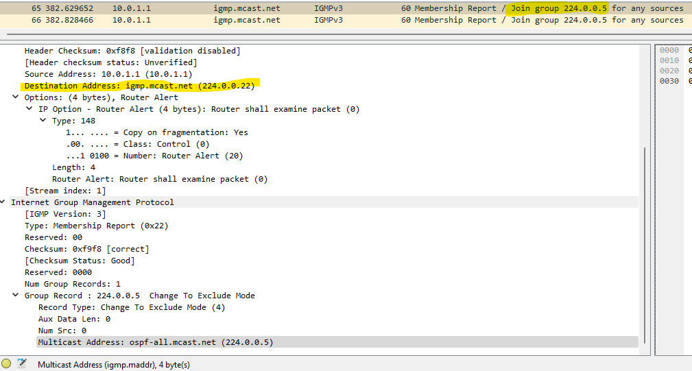
Но тут мне не совсем понятно почему destination address 224.0.0.22 <br>
далее 2-ва соседа обмениваются hello сообщениями
2-е сообщение после подписки на мультикаст, идет INITialization  ОТ LEAF1, Т.К НА НЕМ УЖЕ OSPF НАСТРОЕН И РАБОТАЕТ<br>
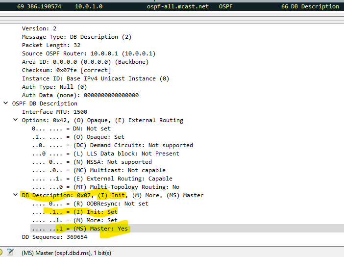
<br>
Spine 1 отвечает аналогичным сообщением init, в нем практически ничего не отличается кроме cheksum
<br>
Leaf1 Шлет OSPF, LSA-1 <br>
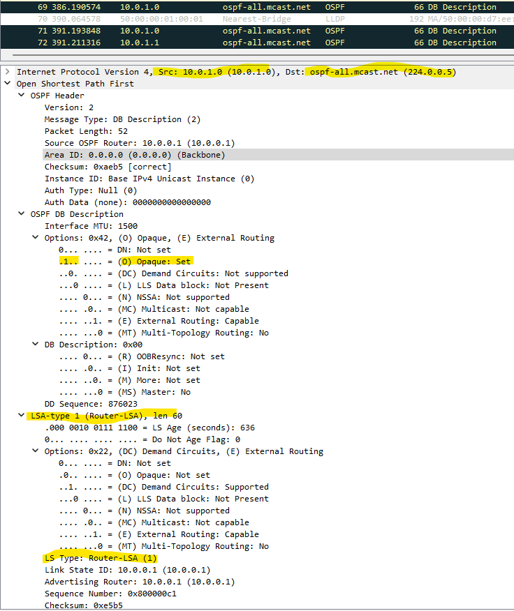
<br>
Далее  видим сообщение __Link State request__ <br>
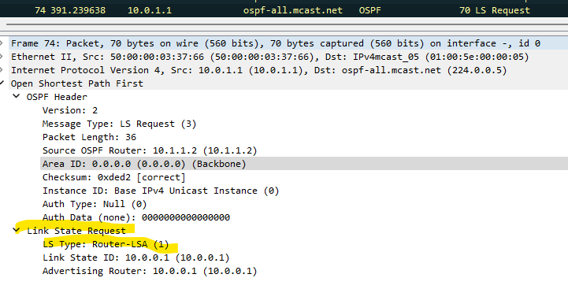 <br>

Далее, в сообщении OSPF мы видим используется в качестве Router ID, значение интерфейса loopback2 spine 1, это довольно странно, чуть позже посморим конфигурацию спайн1. <br>
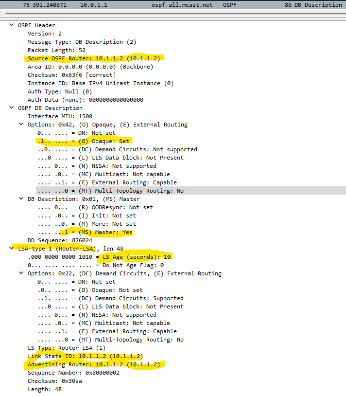 <br>
А теперь ребята, мы видим, наконец-то пришел Link State Update, от нашего Leaf1, c перечислением 3-х подсетей, которые у него имеются.
Ниже представлен скрин: <br>
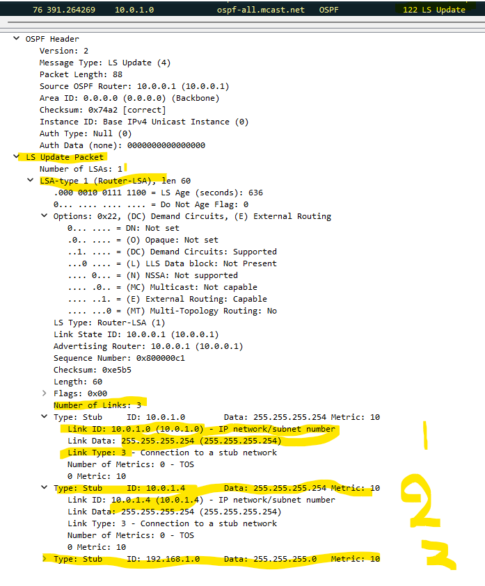
<br>
Далее Leaf1 продолжает свою активность, и в след за сообщением __Link state Update__, посылает __Link state Requet__, снизу представлен пример: <br>
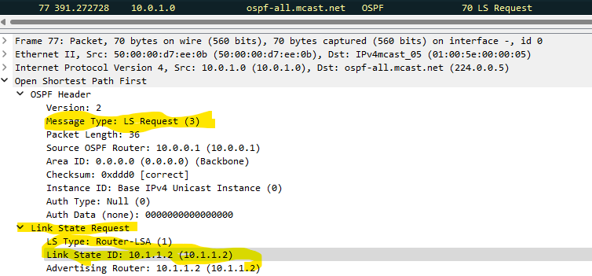 <br>
В свою очередь leaf1 продолжает рассылать различные сообщения, и в этот раз решил послать _ospf DB Description__, что это бы значило, не понятно, но пример представлен снизу: <br>
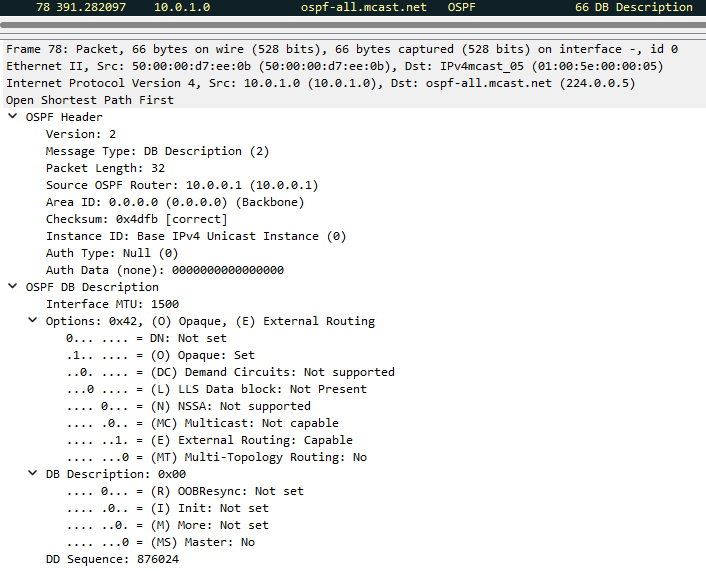
<br>
После всех этих сообщений, spine1 соизволил ответить сообщением __Link State Acknowledge__, пример как обычно представлен под текстом: <br>
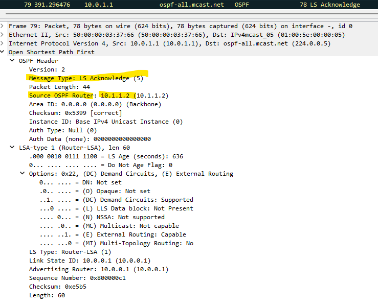
<br>
Затем после __Acknowledge__ spine1 посылает __Link State Update__ message; <br>
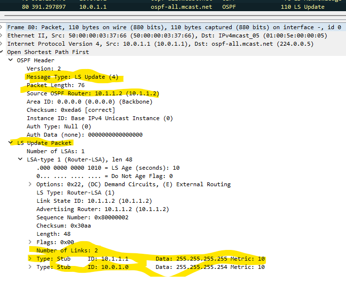
<br>
Spine1 понял, что не все послал, и решил сразу же кинуть еще один __LSA Update__ добавив туда peer to peer сеть, выделил желтым, смотрите: <br>
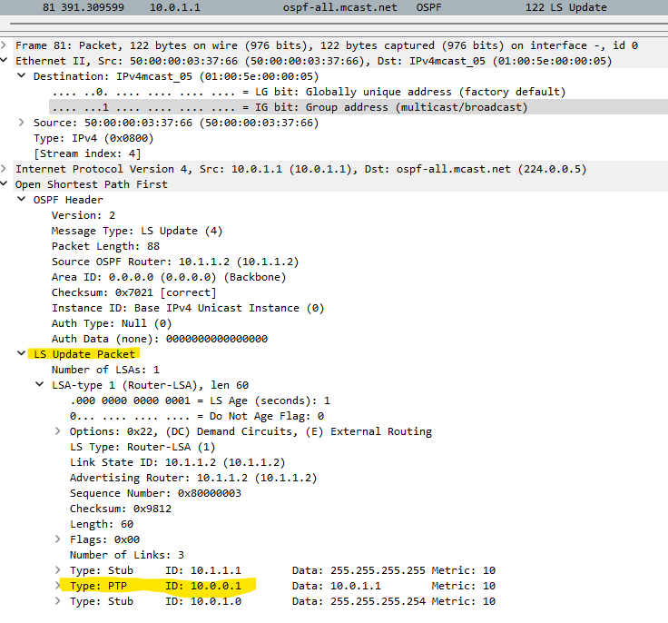
<br>
В знак взаимного уважения, LEAF1 ОТВЕЧАЕТ СООБЩЕНИЕМ __Link State Acknowledge__: <br>
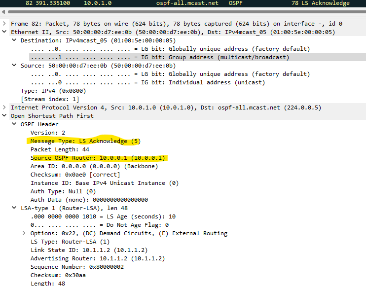
<br>
<br><br>
Далее они еще раз по очереди обменяются любезностями, вместе со своими пакетами, потом будут слать друг другу hello пакеты, <br>
с таймером в 10 секунд, проверять не помер ли кто, вот в кратце как-то так. 

## Добавление аналогичных настроек ospf на spine2 и leaf2/3

### Настройки spine2
interface Loopback1 <br>
   description IP for underlay -Router-ID <br>
   ip address 10.2.2.1/32<br>
   __ip ospf area 0.0.0.0__<br>
<br>
<br>
interface Ethernet1<br>
   description Peer-to-peer link to leaf-1<br>
   no switchport<br>
   ip address 10.0.1.5/31<br>
   __ip ospf network point-to-point__ <br>
   __ip ospf area 0.0.0.0__<br>
!<br><br>
interface Ethernet2<br>
   description Peer-to-peer link to leaf-2<br>
   no switchport<br>
   ip address 10.0.2.5/31<br>
   __ip ospf network point-to-point__<br>
   __ip ospf area 0.0.0.0__<br>
!<br><br>
interface Ethernet3<br>
   description Peer-to-peer link to leaf-3<br>
   no switchport<br>
   ip address 10.0.3.5/31<br>
   __ip ospf network point-to-point__<br>
<br><br>
После включения настроенной маршрутизации on spine2, командой ip routing, я снял трейс на spine 1, интерфейс eth1, примерно через 15 секунд, прилетелеи update с leaf1. <br>
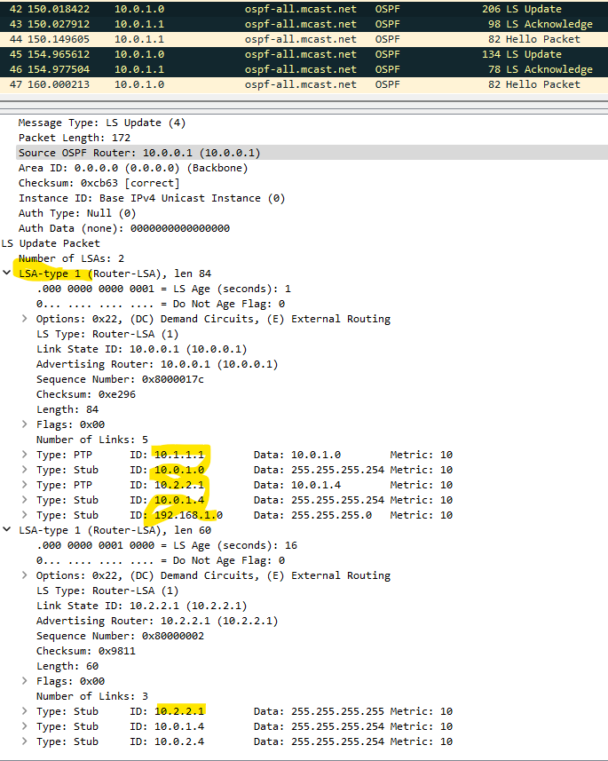<br>
Как видно из трейса 42 сообщение, на Spine1 прилетает __Link State UPDATE__ сообщение, и вслед 43-м сообщением spine1 отвечает __Link State Acknowledge__<br>
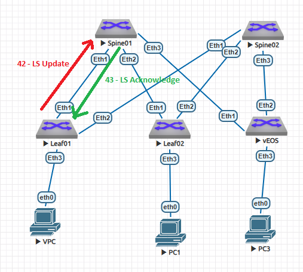<br>
### Проверка появления маршрутов OSPF<br>
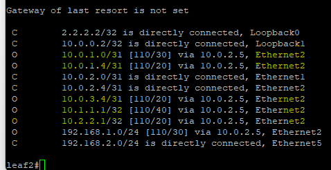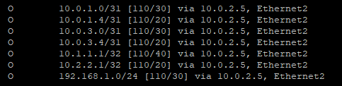
<br>
Обратите внимание, на leaf1 все маршруты приходят, только с интерфейса eth2, __но почему__? Где же дублирующие маршруты, которые должны приходить с eth1? Проверим настройки Spine1. <br>
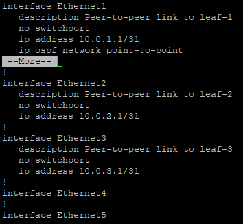<br>
Как видно из настроек spine 1, ospf не включен, на интерфейсах идущих к leaf2,3. Давайте же включим OSPF на интерфейсах eth 2/3 spine1
<br>
Вот так выглядят настройки интерфесов, после внесения дополнений: <br>
interface Ethernet2 <br>
   description Peer-to-peer link to leaf-2<br>
   no switchport<br>
   ip address 10.0.2.1/31<br>
   __ip ospf network point-to-point__<br>
   __ip ospf area 0.0.0.0__<br>
!<br><br>
interface Ethernet3<br>
   description Peer-to-peer link to leaf-3<br>
   no switchport<br>
   ip address 10.0.3.1/31<br>
   __ip ospf network point-to-point__<br>
   __ip ospf area 0.0.0.0__<br>
<br><br>
После добавления этих строк, маршруты прилетели со spine1, ниже на рисунке представлен вывод ospf маршрутов как видно, теперь каждая сеть доступна через Spine1 и Spine 2. <br>
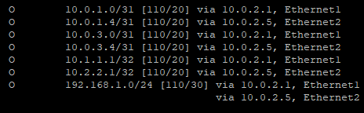<br>
Ну и на последок, пинганем с хоста интерфейс leaf3: <br>
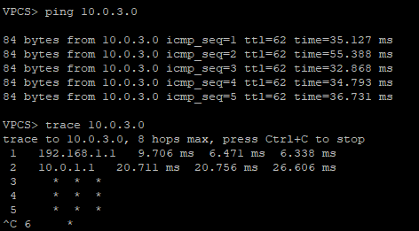 <br>
### Используемые команды: <br>
- show ip ospf summary
- show ip ospf
- show ip ospf neighbor
- show run section ospf
- show log
  


